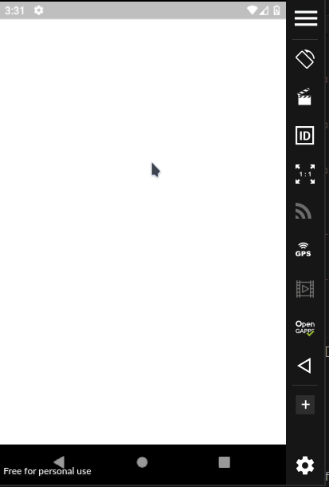

# Rolês app: uma rede social voltada para eventos informais (rolês)

## 📖 Descrição

Esse projeto é um MVP e se refere a ideia de uma rede social voltada para a marcação de eventos sociais informais (rolês). Nela seria possível chamar amigos para sair ao definir data, horário e detalhes do rolê. Além disso, seria possível interagir em postagens de rolês dos amigos.

## 🛠️ Funcionalidades

- Visualizar feed de rolês
- Cadastrar um rolê
- Fazer login
- Cadastrar-se
- Ver a localização de um rolê por meio da API da Google

## 📡 Tecnologias utilizadas

 

  

  

## ⏳ Inicialização

Esse projeto foi desenvolvido em [Flutter](https://flutter.dev/) utilizando as bibliotecas [sqflite](https://pub.dev/packages/sqflite), [shared_preferences](https://pub.dev/packages/shared_preferences), [path](https://pub.dev/packages/path), entre outras.

## 🤵🤵‍♀️ Colaboradores

Os colaboradores desse projeto foram eu (Eduardo Vítor), [Tamilly Nascimento](https://github.com/tamilly), [Jânio](https://github.com/GameleiraMonster) e [Carlos](https://github.com/oicarlos).

 

## 🔎 Status do Projeto

 

## 📑 Referências

[Flutter](https://flutter.dev/)

[sqflite](https://pub.dev/packages/sqflite)

[shared_preferences](https://pub.dev/packages/shared_preferences)

[path](https://pub.dev/packages/path)